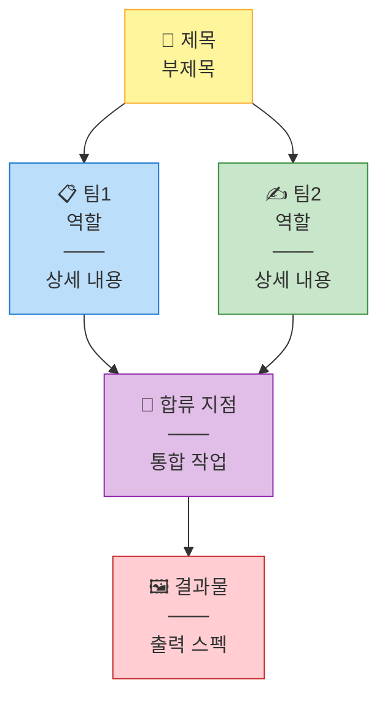
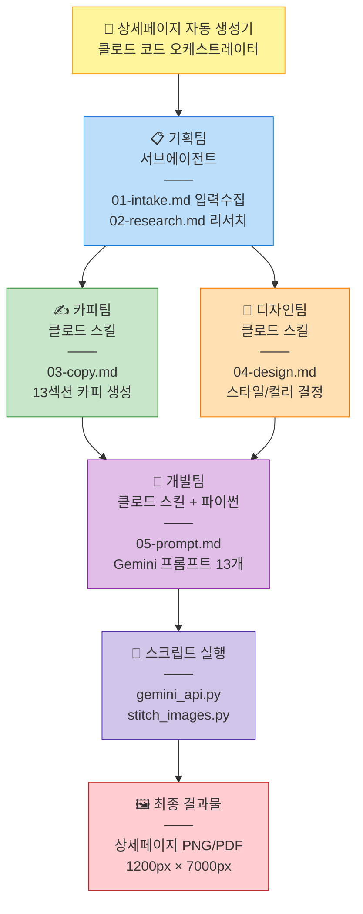

# 다이어그램 스타일 프리셋

## 색상 팔레트

| 역할 | 배경색 | 테두리색 | 용도 |
|------|--------|----------|------|
| 메인/오케스트레이터 | `#fff59d` | `#f9a825` | 🟡 노란색 - 전체 조율 |
| 기획팀/서브에이전트 | `#bbdefb` | `#1976d2` | 🔵 파란색 - 분석/리서치 |
| 카피팀/스킬 | `#c8e6c9` | `#388e3c` | 🟢 초록색 - 콘텐츠 생성 |
| 디자인팀/스킬 | `#ffe0b2` | `#f57c00` | 🟠 주황색 - 비주얼 |
| 개발팀/스킬+코드 | `#e1bee7` | `#8e24aa` | 🟣 보라색 - 기술 구현 |
| 스크립트/자동화 | `#d1c4e9` | `#512da8` | 🟣 연보라 - 실행 |
| 결과물/출력 | `#ffcdd2` | `#c62828` | 🔴 빨간색 - 최종 산출물 |

---

## Mermaid 기본 템플릿



---

## 상세페이지 생성기 전체 구조



---

## 노드 작성 규칙

### 1. 노드 내용 구조
```
["이모지 제목<br/>부제목<br/>───<br/>상세1<br/>상세2"]
```

### 2. 병렬 처리 표현
```mermaid
A --> B
A --> C
B --> D
C --> D
```
→ B와 C가 같은 줄에 배치되고 D에서 합류

### 3. 이모지 가이드
| 역할 | 이모지 |
|------|--------|
| 메인/시작 | 🎯 |
| 기획/분석 | 📋 📊 🔍 |
| 카피/콘텐츠 | ✍️ ✏️ 📝 |
| 디자인 | 🎨 🖌️ |
| 개발/기술 | 🤖 ⚙️ 💻 |
| 스크립트 | 🐍 🔧 |
| 결과물 | 🖼️ 📤 ✅ |

---

## 사용법

1. 이 파일의 템플릿 복사
2. 노드 내용 수정
3. Whimsical MCP로 생성:
```
mcp__whimsical__create_whimsical_diagram 호출
- title: 다이어그램 제목
- mermaid_markup: 위 코드 붙여넣기
```

---

## Whimsical 링크

- 최종 버전: https://whimsical.com/EHpEe9G1Fvk4CVeSqQqU55
